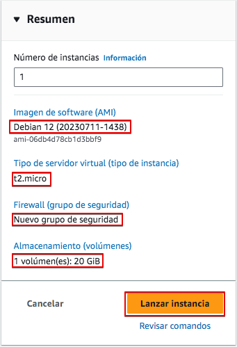

# Linux Server en AWS Academy

En esta nota veremos cómo crear un servidor Linux en AWS. El servidor Linux no tendrá entorno gráfico, sólo de comandos, por lo que nos bastará acceder a él por SSH.

Primero, debemos acceder al [portal de AWS Academy](https://www.awsacademy.com/vforcesite/LMS_Login){:target="_blank"} utilizando nuestra cuenta de AWS Academy.

En las siguientes imágenes, mostraremos con un cuadro rojo las opciones a selecciona o en aquellas que deben cambiarse o revisarse. Puedes olvidarte del resto de las opciones disponibles por ahora.

Accede al LMS, donde encontrarás los cursos disponibles.

Busca el **Learner Lab** que tu profesor ha preparado para este curso. Previamente te habrá invitado y habrás tenido que aceptar la invitación para tener acceso al mismo.

Selecciona "Módulos" para acceder al laboratorio.

Abre el "Laboratorio de Aprendizaje".

Inicia el laboratorio:

Una vez iniciado, verás un punto verde junto a **AWS**. Haz clic allí para abrir la consola de AWS y comenzar a trabajar.

Ahora tienes acceso a la consola de AWS. Dependiendo de tu uso previo de esta consola, es posible que veas diferentes elementos en la pantalla.

En AWS, los servidores virtuales se llaman EC2, así que comencemos por crear un EC2. Puedes hacerlo de diferentes maneras. Veamos una de ellas. Desplázate hacia abajo hasta "Crear una solución" y haz clic en "Iniciar una máquina virtual"

Ahora debemos proporcionar los parámetros necesarios para crear la máquina. Sigue las pantallas con los datos proporcionados.

Vamos a crear un servidor linux Debian. En primer lugar seleccionamos un nombre y tipo de servidor:

A continuación, en "Tipo de instancia" seleccionaremos el procesador y la memoria. Ten en cuenta que a mayor potencia, mayor costo. Para esta práctica nos bastará el más sencillo.

La sección de "Par de claves" (inicio de sesión) es muy importante, ya que aquí crearemos el par de claves que nos permitirá acceder al servidor de forma remota. Creemos un nuevo par de claves que nos pueden servir para el resto del curso.

Asegúrate de guardar el par de claves en tu computadora o no podrás acceder al servidor después.

Ahora, tras volver a la pantalla anterior, selecciona el par de claves generadas.

Debemos definir la configuración de red de nuestra VM. En AWS al Firewall se le denomina "Grupo de seguridad", y en él definiremos todas las reglas necesarias para permitir y denegar accesos a nuestra VM. En este caso sólo habilitaremos el acceso por SSHpara gestionar la máquina, así que bastará con aceptar la configuración por defecto ofrecida.

Finalmente, debemos configurar el almacenamiento. Proporcionemos un volumen de 20 GiB.

Verifica todas las opciones seleccionadas y lanza la instancia.

Si todo va bien, la instancia se creará y obtendremos un mensaje que lo indica.

Si hacemos click sobre el código de la instancia pasaremos a la consola de EC2 y veremos que la VM está en ejecución y todos sus datos relacionados, entre ellos la dirección IP pública que necesitaremos más tarde para acceder a la misma.

Ahora podemos acceder al servidor utilizando SSH. Primero haz clic en "Conectar" para permitir la conexión. Selecciona el cliente SSH. Ahí tienes toda la información necesaria para realizar la conexión.

Recuerda el "par de claves" que te dije que almacenaras en tu computadora previamente. Ese es el que debes usar ahora. AWS asume que se guardó con extensión `.pem` pero si se ha guardado con otra extensión, cámbialo previamente. Aquí te muestro una secuencia de conexión, asumiendo que el certificado se guardó con extensión `.cer`.

Como verás, ya estás dentro del servidor debian que hemos instalado.

Podemos comprobar cómo la capacidad del disco y la memoria coinciden con la que configuramos en la consola AWS.

> RECUERDA
>
> La IP pública de la VM podría cambiar. Comprueba antes de cada conexión la IP de la máquina.

## Finaliza el laboratorio

Al finalizar cada sesion de trabajo recuerda que debes finalizar el laboratorio. Ve a la consola de AWS Academy y presiona "Finalizar laboratorio". Si no lo haces, el laboratorio se cerrará automáticamente después de 4 horas pero habrás gastado más saldo del necesario.

Comprueba que el laboratorio esta parado. El punto junto a AWS deberá estar de color rojo.

## Detener una instancia

En AWS Academy, cada vez que iniciamos el laboratorio, se pondrán en marcha todas las máquinas y servicios creados. Esto puede suponer un consumo de recursos innecesario si no vamos a utilizar algunas de ellas. Por eso es importante parar aquellas máquinas (instancias) que no vayamos a utilizar en un momento dado. 

Para detener una máquina hemos de ir a "Instancias", seleccionarla y a continuación ir al botón "Estado de la instancia".

Seguidamente seleccionaremos "Detener instancia"

Y comprobaremos cómo la instancia queda detenida.

## Eliminar una instancia

Aunque tengamos un EC2 detenido, puede estar consumiendo recursos solo por el hecho de estar creada. Es el caso de los recursos de almacenamiento.

Por tanto, una vez una máquina ya no nos és útil, lo mejor es eliminarla de forma definitiva. Para ello seguiremos el procedimiento visto para pararla, pero seleccionaremos la opción "Terminar instancia"

Veremos que la instancia estará terminada y dejará de aparecer en el listado de instancias en futuras conexiones.

Al terminar la instancia se liberarán algunos de los recursos asociados si así lo configuramos al crearla. En nuestro caso seleccionamos que el volúmen se eliminara al eliminar la EC2. 

Pero puede que otros no se liberen automáticamente, como los grupos de seguridad.

No entraremos en esto ahora, pero puedes consultar los distintos recursos existentes y eliminar los que no sean necesarios desde el panel de EC2.

