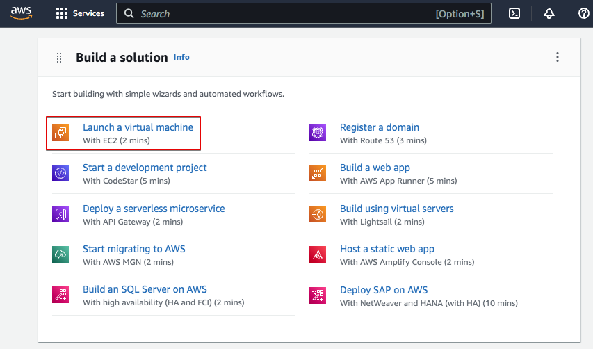
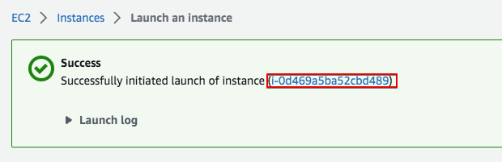
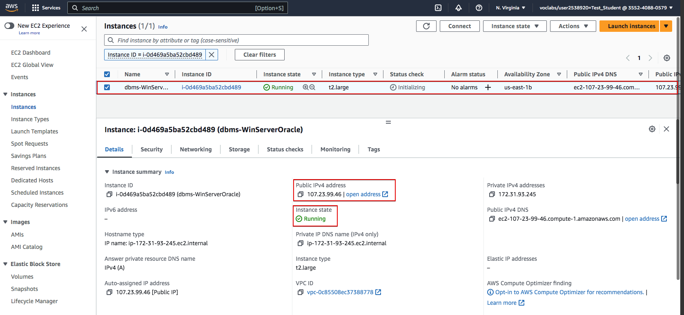
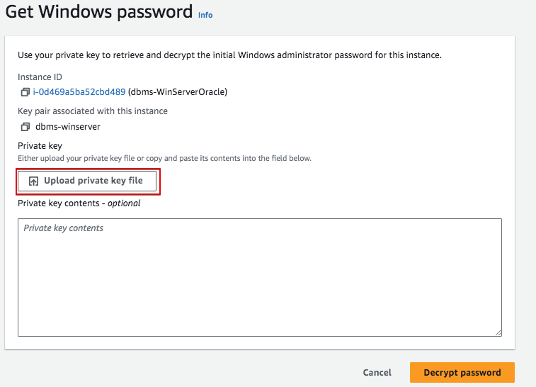
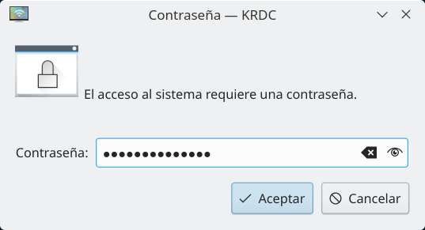
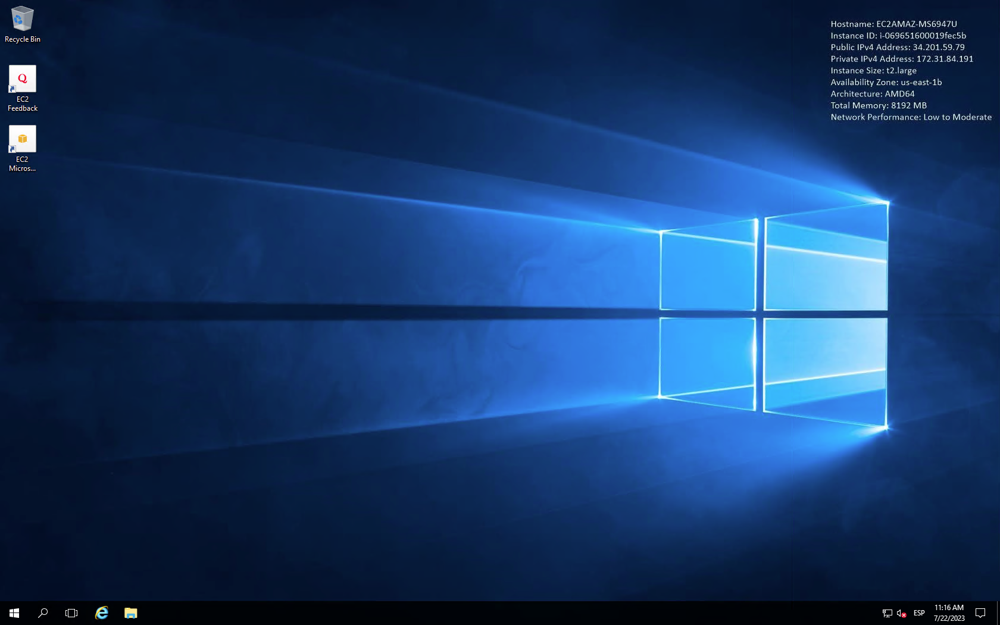
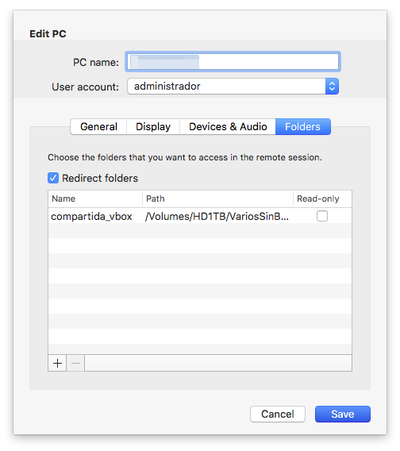

# Windows Server en AWS Academy

En esta nota veremos cómo crear un servidor Windows en AWS. La principal diferencia con un servidor Linux es que accederemos al servidor mediante un entorno gráfico mediante el protocolo RDP.

Accederemos a la consola de AWS Academy igual que hicimos en la práctica anterior. En las siguientes imágenes, mostraremos con un cuadro rojo las opciones que deben cambiarse o revisarse. Puedes olvidarte del resto de las opciones disponibles por ahora.

En AWS, como ya vimos, los servidores virtuales se llaman EC2. Comencemos por crear un EC2. Puedes hacerlo de diferentes maneras. Veamos una de ellas. Desplázate hacia abajo hasta "Crear una solución" y haz clic en "Iniciar una máquina virtual"

Debemos proporcionar los parámetros para crear la máquina. Sigue las pantallas con los datos proporcionados.

Un Windows Server 2016 será suficiente para esta práctica:

En este caso, vamos a crear una máquina potente. Podemos elegir un tipo de instancia t2.large con 2 CPU virtuales y 8 GiB de memoria.

La sección de "Par de claves" (inicio de sesión) es muy importante, ya que aquí seleccionarmeos el par de claves que nos permitirá acceder al servidor de forma remota. Podemos crear un nuevo par de claves para acceder a esta máquina o usar el que ya creamos en la práctica anterior. Si usamos las ya creadas podemos saltar este paso.

Asegúrate de guardar el par de claves en tu computadora o no podrás acceder al servidor después.

Debemos definir la configuración de red de nuestra VM. Necesitamos acceder a través de RDP. En el módulo de DAW vamos a instalar servicios web, así que vamos a habilitar también el acceso por HTTP y HTTPS. Permitamos RDP, HTTP y HTTPS desde Internet.

Finalmente, debemos configurar el almacenamiento. Proporcionemos un volumen de 80 GiB.

Verifica todas las opciones seleccionadas y lanza la instancia.

Si todo va bien, la instancia se creará y ahora podemos verla en la consola EC2.

En la consola de EC2, vemos que la VM está en ejecución y todos los datos relacionados, como la dirección IP pública que necesitaremos más tarde para acceder a la misma.

Ahora podemos acceder al servidor utilizando RDP. Primero haz clic en "Conectar" para permitir la conexión. Selecciona el cliente RDP. Y, en primer lugar, obtén la contraseña del administrador.

Recuerda el "par de claves" que te dije que almacenaras en tu computadora previamente. Ese es el que debes usar ahora. Usa "Cargar archivo de clave privada" y carga tu "par de claves" almacenado.

Una vez leído, puedes "Descifrar contraseña"

Será una contraseña difícil de recordar. Solo cópiala y luego podrás cambiarla desde el interior del servidor Windows.

Es una buena práctica crear un documento de texto y copiar allí toda la información de la pantalla "Conectar a la instancia": ID de instancia, DNS público, nombre de usuario y contraseña. 

Ahora podemos usar un software de escritorio remoto para hacer la conexión. En Lliurex tenemos KRDC y Remmina. También podríamos usar Windows Remote Desktop en Windows o Mac.

## Conexión usando KRDC

En las siguientes imágenes, podemos ver cómo usar KRDC para hacer la conexión.

Simplemente selecciona el protocolo RDP y el DNS público (en lugar de la IP que se muestra en la imagen).

Podemos configurar algunas cosas, como la resolución de pantalla o el teclado. También puedes hacer una carpeta en tu disco duro disponible para tu VM, de la misma manera que usas carpetas compartidas en VirtualBox.

Luego te pedirá el usuario y la contraseña.

Y se establecerá la conexión.

## Conexión usando Microsoft Remote Desktop

Puedes usar Microsoft Remote Desktop en Windows y Mac.

Como en KRDC, podemos compartir carpetas entre nuestra computadora y la Máquina Virtual, de la misma manera que compartimos carpetas en un software de virtualización (como VirtualBox).

Descarga el software para Windows desde [Microsoft Store](https://apps.microsoft.com/){:target="_blank"} o para Mac en la [App Store](https://www.apple.com/es/app-store/){:target="_blank"}.

Ahora podemos "Descargar archivo de escritorio remoto" para acceder rápidamente al servidor. Simplemente descarga el archivo RDP desde AWS y luego haz doble clic en él.

Pero aconsejo hacerlo de esta otra manera para crear primero una carpeta compartida. Abre Microsoft Remote Desktop y ve al menú "Conexiones -> Agregar PC".

Luego sigue los pasos. Completa el nombre de PC con el DNS público de la VM. En la cuenta de usuario, crea una nueva para el usuario "Administrador" creado previamente con la contraseña obtenida.

En la pestaña "Carpetas", crea una carpeta compartida con tu computadora. Primero crea la carpeta local. Luego, usa el botón "+" para agregarla.

La próxima vez que abras la conexión, encontrarás una unidad de red en tu VM que es la carpeta local en tu PC. Es una forma muy conveniente de compartir archivos entre ambos sistemas.

Una vez que se haya completado toda la configuración, lo encontrarás en la página principal cada vez que abras la aplicación.

> RECUERDA
>
> La IP pública de la VM podría cambiar. Tendrás que editar la conexión creada cada vez que quieras conectarte a la VM, pero solo tendrás que cambiar la dirección IP, manteniendo el resto de la configuración.

## Finaliza el laboratorio

Al finalizar cada sesion de trabajo recuerda que debes finalizar el laboratorio. Ve a la consola de AWS Academy y presiona "Finalizar laboratorio". Si no lo haces, el laboratorio se cerrará automáticamente después de 4 horas pero habrás gastado más saldo del necesario.

## Elimina la instancia

Para que la instancia creada no consuma recursos, puedes borrarla al finalizar la práctica, como vimos en la práctica anterior.
