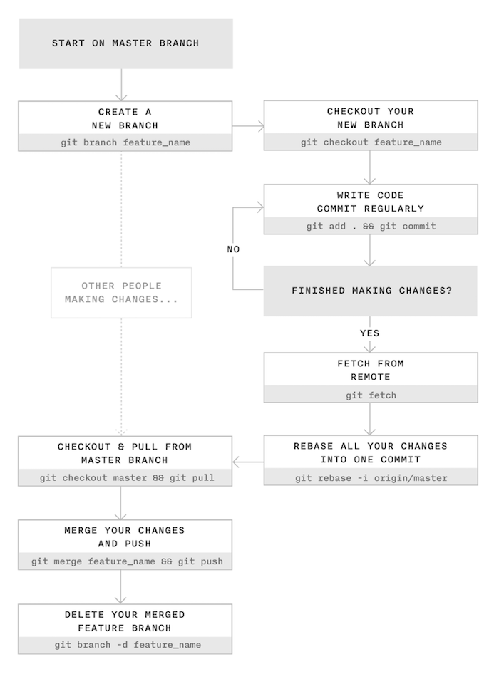

## ¿Qué vas a aprender en este taller?

* Aprenderás el concepto de rama.
* La gestión y el ciclo de vida (creación, modificación, borrado, ...) de ramas.
* Aprenderás el concepto de unión (merge) que nos posibilita la fusión de ramas.
* A solucionar los posibles conflictos que pueden aparecer en el momento del merge.

## Cómo trabajar en equipo con `git`

Git nos permite trabajar de forma colaborativa en un proyecto mediante el concepto de "rama". Cada miembro del proyecto puede crear una rama del mismo, realizar modificaciones y, posteriormente, unir nuevamente las modificaciones realizadas por cada miembro en la rama principal. Git se encargará de detectar qué se ha modificado (incluso si más de un miembro han modificado la misma parte del proyecto) mostrándonos los cambios y permitiéndonos elegir qué integrar en la rama principal y qué no.

La siguiente imagen muestra una secuencia de trabajo colaborativa en un proyecto git.



Figura 2: Imagen extraída del blog de [James Chambers](http://jameschambers.co/writing/git-team-workflow-cheatsheet/).

Se recomienda leer el *post* [Using Git in a team: a cheatsheet](http://jameschambers.co/writing/git-team-workflow-cheatsheet/). 

Veamos cómo llevar a cabo este trabajo con ramas aunque no abordaremos el proceso completo que muestra este diagrama. De momento nos centraremos en crear una nueva rama, trabajar en ella, unirla con la principal y finalmente eliminarla.

## ¿Qué tienes que hacer?

Trabaja con el repositorio de los talleres anteriores.

1. Una rama representa una línea independiente de desarrollo, es como crear un nuevo área de trabajo que tendrá su historial propio de commits.
2. Para  listar las ramas locales ejecuta:

	```sh
		$ git branch
		* main
	```

	La rama en la que estás trabajando actualmente se señala con un asterisco *. La rama **main** (en proyectos antiguos se llama **master**) es la rama con la que se comienza en cualquier proyecto, y es la que se utiliza como rama principal donde se encuentra el proyecto en su estado final. 

3. Crea una nueva rama con la instrucción:

	```sh
		$ git branch nuevarama
	```
	 	
4. Vuelve a lista las ramas, comprueba que todavía estás en la rama `main`, para pasar a la nueva rama utiliza el comando:

	```sh
		$ git checkout nuevarama
	```	

	* Comprueba que en la nueva rama tienes los mismos ficheros que en la rama principal.
	* Todos los cambios que realices en los ficheros en esta rama no se verán en la rama principal.
	* Truco: con el comando `git checkout -b [rama]` se crea una nueva rama y te posicionas en ella.
	* Con el comando `git branch -v` se ve el último commit de cada rama. Comprueba que coinciden el último commit en las dos ramas.
	* Truco: Puedes usar una extensión de tu shell (bash, zsh,...) para que te muestre en el prompt la rama en la que estás trabajando.
  
		
5. Prueba a modificar algún fichero y crea un nuevo fichero en esta rama. Realiza el commit y comprueba que estos cambios no se han reflejado en los ficheros de la rama principal. Ejecuta `git branch -v` para ver el último commit de cada rama.
   
6. Las ramas no se crean automáticamente en GitHub, hay que realizar un `push` para crearlas en remoto. **Nota: `origin` es el nombre del repositorio remoto.** Por lo tanto ejecutamos: 

	```sh
		$ git push origin nuevarama
	```
	Comprueba en GitHub que se ha creado la nueva rama y que puedes seleccionar las 2 ramas existentes.
		
7. Una vez que has trabajado en una rama, lo normal es querer incorporar los cambios a la rama principal. Para **unir** una rama a la principal, ejecutamos:
	
	```sh
		$ git checkout main
		$ git merge nuevarama
	```
	Cuando sólo se han **añadido o eliminado** archivos en una rama, es fácil unirla a la principal. El resultado simplemente será la suma o resta de esos archivos en la principal. Cuando se hacen **modificaciones** en archivos, incluyendo cambios en los nombres de los archivos, git detecta esos cambios y los adapta automáticamente, pero a veces surgen **conflictos**.

	Realiza la fusión de la nueva rama a la principal. ¿Se han producido conflictos?
	

8.  Los conflictos aparecen cuando se ha modificado la misma parte del código en dos ramas diferentes. Veamos un ejemplo:

	* Crea un fichero `prueba.txt` en la rama principal. Recuerda hacer un commit.
	* Crea una nueva rama y accede a ella. 
	* Modifica el fichero en la nueva rama. Recuerda hacer un commit.
	* Vuelve a la rama principal. Y modifica de nuevo el fichero antes de realizar el merge.
	* Realiza la unión y aparece el conflicto:

		```sh
			$ git merge nuevo 
			Auto-fusionando prueba.txt
			CONFLICTO (contenido): Conflicto de fusión en prueba.txt
			Fusión automática falló; arregle los conflictos y luego realice un commit con el resultado.
		```

	* Si miramos el fichero:

	```sh
			$ cat prueba.txt 

			<<<<<<< HEAD
			Hola cómo estás
			=======
			hola que tal
			>>>>>>> nuevo
		```

	Tenemos el contenido que estaba en la rama principal (**HEAD**) y lo que estaba en la rama **nuevo**. Será el usuario el que tendrá que dejar el contenido del fichero como quiera editando directamente el fichero en la rama main.

9. Es bastante frecuente crear una rama, hacer los cambios que sean necesarios, unirla a una rama principal y después eliminar la rama que se había creado.  Para eliminar una rama en local ejecutamos: 
	```sh
		$ git branch -d nuevarama
	```
	Para eliminarla en remoto
	```sh
		git push origin --delete nuevarama
	```
	Si queremos eliminarla tanto en local como en remoto deberemos ejecutar ambos comandos.

10. Acaba la práctica eliminando el repositorio remoto en GitHub y el directorio local que has creado.
    1.  En GitHub ve al proyecto, Settings, General, "Danger zone" y selecciona "Delete this repository"
    2.  En local utiliza `rm -Rf pruebanombre` para eliminar todos el directorio del proyecto.


!!!Task "Hazlo tú solo"
    1. Crea una rama que se llame `primera` en tu local, y ejecuta la instrucción necesaria para comprobar que se ha creado.
    2. Crea un nuevo fichero en esta rama y fusiónalo con la principal. ¿Se ha producido conflicto? Razona la respuesta.
    3. Borra la rama `primera`.
    4. Crea una rama que se llame `segunda`, y modifica un fichero en ella para producir un conflicto al unirlo a la rama principal. Observa el contenido del fichero donde se ha producido el conflicto.
    5. Soluciona el conflicto que has creado en el punto anterior y sincroniza la rama `segunda` en el remoto. Comprueba que se ha creado la rama en el repositorio de GitHub.

