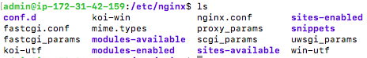

## Sitios virtuales

Un servidor nginx puede estar sirviendo varias páginas web. A cada una de ellas la denominaremos un "sitio virtual" o "host virtual". Veamos cómo podemos hacer que nuestro servidor sirva varias páginas.

### Creamos la estructura para el nuevo sitio web

En primer lugar vamos a crear la nueva página web.

Creamos la carpeta de nuestro nuevo sitio web que llamaremos practica2_2: 

```sh
sudo mkdir -p /var/www/practica2_2/html
```
Ahí, dentro de esa carpeta html crea un archivo index.html. Puedes copiar el que hemos usado antes cambiando el contenido a "Práctica 2.2"

Además, haremos que el propietario de esta carpeta y todo lo que haya dentro sea el usuario `www-data`, típicamente el usuario del servicio web.

```sh
sudo chown -R www-data:www-data /var/www/practica2_2/html
```

Y le daremos los permisos adecuados para que no nos de un error de acceso no autorizado al entrar en el sitio web: 

```sh
sudo chmod -R 755 /var/www/practica2_2/html
```

### Modificamos la configuración

Los archivos de configuración de nginx los podemos encontrar en `/etc/nginx`.



En Nginx hay dos rutas importantes. La primera de ellas es **`sites-available`**, que contiene los archivos de configuración de los hosts virtuales o bloques disponibles en el servidor. Es decir, cada uno de los sitios webs que alberga el servido. La otra es **`sites-enabled`**, que contiene los archivos de configuración de los sitios habilitados, es decir, los que funcionan en ese momento. 

Dentro de `sites-available` hay un archivo de configuración por defecto (default), que es la página que se muestra si accedemos al servidor sin indicar ningún sitio web o cuando el sitio web no es encontrado en el servidor (debido a una mala configuración por ejemplo). Esta es la página que nos ha aparecido en el apartado anterior. 

Para que Nginx presente el contenido de nuestra web, es necesario crear un bloque de servidor con las directivas correctas. En vez de modificar el archivo de configuración predeterminado directamente, crearemos uno nuevo en `/etc/nginx/sites-available/nombre_web`: 

```console
sudo nano /etc/nginx/sites-available/practica2_2 
```

Y el contenido de ese archivo de configuración: 

```aconf
server {
        listen 80;
        listen [::]:80;
        root /var/www/practica2_2/html;
        index index.html index.htm index.nginx-debian.html;
        server_name practica2_2;
        location / {
                try_files $uri $uri/ =404;
        }
}
```

Aquí la directiva root debe ir seguida de la ruta absoluta dónde se encuentre el archivo index.html de nuestra página web.

Y crearemos un archivo simbólico entre este archivo y el de sitios que están habilitados, para que se dé de alta automáticamente. 

```console
sudo ln -s /etc/nginx/sites-available/practica2_2 /etc/nginx/sites-enabled/
```

Y reiniciamos el servidor para aplicar la configuración: 

```sh
sudo systemctl restart nginx
```

## Comprobaciones

### Comprobación del correcto funcionamiento

Como aún no poseemos un servidor DNS que traduzca los nombres a IPs, debemos hacerlo de forma local en nuestro equipo. Vamos a editar el archivo `/etc/hosts` <u>**de nuestra máquina anfitriona**</u> para que asocie la IP de la máquina virtual, a nuestro `server_name`.

Este archivo, en Linux, está en: `/etc/hosts`

Y en Windows: ` C:\Windows\System32\drivers\etc\hosts`

Y deberemos añadirle la línea:

 `ip_publica_servidor practica2_2`
    
donde debéis sustituir la *ip_publica_servidor* por la que tenga vuestra máquina virtual.
Si queremos tener varios dominios o sitios web en el mismo servidor nginx (es decir, que tendrán la misma IP) debemos repetir todo el proceso anterior con el nuevo nombre de dominio que queramos configurar.


!!!task "Tarea 1"
    Configura un nuevo dominio (nombre web) para el sitio web estático que puedes descargarte del siguiente repositorio:

    `https://github.com/cloudacademy/static-website-example`

    Para ello, crea en `/var/www`  la carpeta del nuevo sitio (por ejemplo, `tarea1`) y dentro de ésta la carpeta `html`. Dentro de la carpeta `html` debéis clonar el repositorio y habrá que cambiar el propietario de la carpeta del sitio y asignar los permisos adecuados.

!!!task "Tarea 2"
    Configura un nuevo dominio (nombre web) para el sitio web estático que puedes descargarte del siguiente repositorio:

    `https://github.com/The-Codesis/simple-static-website.git`

    Deberás realizar los mismos pasos que en la tarea anterior.


## Cuestiones finales

!!!Task "Cuestión 1"
    ¿Qué pasa si no hago el link simbólico entre ```sites-available``` y ```sites-enabled``` de mi sitio web?

!!!Task "Cuestión 2"
    ¿Qué pasa si no le doy los permisos adecuados a ```/var/www/nombre_web```? 


