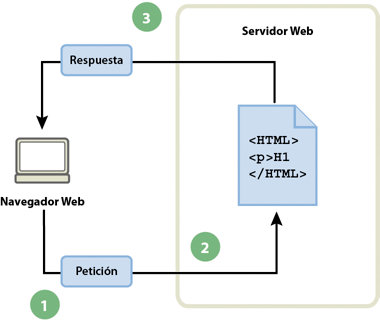
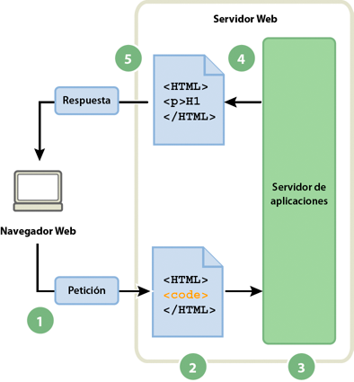
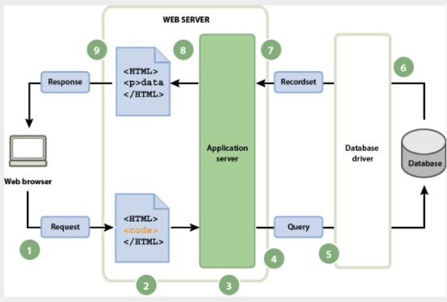

## Funcionamiento de una aplicación Web

Una aplicación Web es un conjunto de páginas Web estáticas y dinámicas. Una página Web estática es aquella que no cambia cuando un usuario la solicita: el servidor Web envía la página al navegador Web solicitante sin modificarla. Por el contrario, el servidor modifica las páginas Web dinámicas antes de enviarlas al navegador solicitante. La naturaleza cambiante de este tipo de página es la que le da el nombre de dinámica.

Por ejemplo, podría diseñar una página para que mostrara los resultados del programa de salud y dejara cierta información fuera (como el nombre del empleado y sus resultados) para calcularla cuando la página la solicite un empleado en particular.

En las siguientes secciones se describe con mayor detalle el funcionamiento de las aplicaciones Web.

### Procesamiento de páginas web estáticas

Un sitio Web estático consta de un conjunto de páginas y de archivos HTML relacionados alojados en un equipo que ejecuta un servidor Web.

Un servidor Web es un software que suministra páginas Web en respuesta a las peticiones de los navegadores Web. La petición de una página se genera cuando el usuario hace clic en un vínculo de una página Web, elige un marcador en un navegador o introduce una URL en el cuadro de texto Dirección del navegador.

El contenido final de una página Web estática lo determina el diseñador de la página y no cambia cuando se solicita la página. A continuación se incluye un ejemplo:

```html
<html> 
    <head> 
        <title>Trio Motors Information Page</title> 
    </head> 
    <body> 
        <h1>About Trio Motors</h1> 
        <p>Trio Motors is a leading automobile manufacturer.</p> 
    </body> 
</html>
```
El diseñador escribe todas y cada una de las líneas de código HTML de la página antes de colocarla en el servidor. El código HTML no cambia una vez colocado en el servidor y por ello, este tipo de páginas se denomina página estática.

Cuando el servidor Web recibe una petición de una página estática, el servidor lee la solicitud, localiza la página y la envía al navegador solicitante, como se muestra en el siguiente ejemplo:




*Procesamiento de una página web estática*

1. El navegador web solicita la página estática. 
2. El servidor localiza la página.
3. El servidor Web envía la página al navegador solicitante.


En el caso de las aplicaciones Web, algunas líneas de código no están determinadas cuando el usuario solicita la página. Estas líneas deben determinarse mediante algún mecanismo antes de enviar la página al navegador. En la siguiente sección se describe dicho mecanismo.

## Procesamiento de páginas dinámicas

Cuando un servidor Web recibe una petición para mostrar una página Web estática, el servidor la envía directamente al navegador que la solicita. Cuando el servidor Web recibe una petición para mostrar una página dinámica, sin embargo, reacciona de distinta forma: transfiere la página a un software especial encargado de finalizar la página. Este software especial se denomina servidor de aplicaciones.

El servidor de aplicaciones lee el código de la página, finaliza la página en función de las instrucciones del código y elimina el código de la página. El resultado es una página estática que el servidor de aplicaciones devuelve al servidor Web, que a su vez la envía al navegador solicitante. Lo único que el navegador recibe cuando llega la página es código HTML puro. A continuación se incluye una vista de este proceso:



*Procesamiento de una página web dinámica*

1. El navegador web solicita la página dinámica.
2. El servidor web localiza la página y la envía al servidor de aplicaciones.
3. El servidor de aplicaciones busca instrucciones en la página y la termina.
4. El servidor de aplicaciones pasa la página terminada al servidor web.
5. El servidor web envía la página finalizada al navegador solicitante. 

## Acceso a una base de datos

Un servidor de aplicaciones le permite trabajar con recursos del lado del servidor, como las bases de datos. Por ejemplo, una página dinámica puede indicar al servidor de aplicaciones que extraiga datos de una base de datos y los inserte en el código HTML de la página. 

El uso de una base de datos para almacenar contenido permite separar el diseño del sitio Web del contenido que se desea mostrar a los usuarios del sitio. En lugar de escribir archivos HTML individuales para cada página, sólo se necesita escribir una página —o plantilla— para los distintos tipos de información que se desea presentar. Posteriormente, podrá cargar contenido en una base de datos y, seguidamente, hacer que el sitio Web recupere el contenido en respuesta a una solicitud del usuario. 

La instrucción para extraer datos de una base de datos recibe el nombre de consulta de base de datos. Una consulta consta de criterios de búsqueda expresados en un lenguaje de base de datos denominado SQL (Structured Query Language). La consulta SQL se escribe en los scripts o etiquetas del lado del servidor de la página.

Un servidor de aplicaciones no se puede comunicar directamente con una base de datos porque el formato de esta última impide que se descifren los datos. El servidor de aplicaciones sólo se puede comunicar con la base de datos a través de un controlador que actúe de intermediario con la base de datos: el software actúa entonces como un intérprete entre el servidor de aplicaciones y la base de datos.

Una vez que el controlador establece la comunicación, la consulta se ejecuta en la base de datos y se crea un juego de registros. Un juego de registros es un conjunto de datos extraídos de una o varias tablas de una base de datos. El juego de registros se devuelve al servidor de aplicaciones, que emplea los datos para completar la página.

A continuación se ofrece una consulta de base de datos sencilla escrita en SQL

```sql
SELECT lastname, firstname, fitpoints 
FROM employees
```

Esta instrucción crea un juego de registros de tres columnas y lo completa con filas que contienen el apellido, el nombre y los puntos de forma física de todos los empleados de la base de datos. 

En el siguiente ejemplo se muestra el proceso de consulta de base de datos y de devolución de los datos al navegador:



*Procesamiento de una página web dinámica con acceso a base de datos*

1. El navegador web solicita la página dinámica.
2. El servidor web localiza la página y la envía al servidor de aplicaciones.
3. El servidor de aplicaciones busca instrucciones en la página.
4. El servidor de aplicaciones envía la consulta al controlador de la base de datos.
5. El controlador ejecuta la consulta en la base de datos.
6. El juego de registros se devuelve al controlador.
7. El controlador pasa el juego de registros al servidor de aplicaciones.
8. El servidor de aplicaciones inserta los datos en una página y luego pasa la página al servidor web.
9. El servidor Web envía la página finalizada al navegador solicitante. 

Puede utilizar prácticamente cualquier base de datos con su aplicación Web, siempre y cuando se haya instalado el controlador de base de datos correcto en el servidor.

Si tiene intención de desarrollar pequeñas aplicaciones de bajo coste, puede utilizar una base de datos basada en archivos, como las que permite crear Microsoft Access. En cambio, si desea desarrollar aplicaciones empresariales críticas, puede utilizar una base de datos basada en servidor, como las que permite crear Microsoft SQL Server, Oracle 9i o MySQL.

Si la base de datos está situada en un sistema distinto del servidor Web, asegúrese de disponer de una conexión rápida entre ambos sistemas para que la aplicación Web pueda funcionar de forma rápida y eficiente.

## Referencias

<https://helpx.adobe.com/es/dreamweaver/using/web-applications.html>