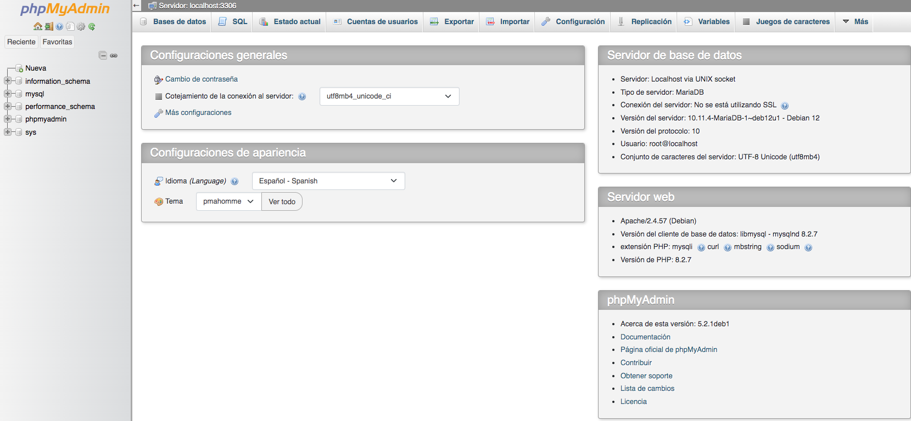

# Practica 3.1 - Instalación de la pila LAMP

## Introducción

Vimos en la teoría que existen distintas plataformas web libres, como LAMP y propietarias, como WISA. En esta práctica instalaremos una plataforma web LAMP completa, formada por: 

* **Linux**: sistema operativo. En nuestro caso usaremos Debian.
* **Apache**: servidor web.
* **MySQL o MariaDB**: gestor de bases de datos. Nosotros instalaremos MariaDb.
* **PHP**: lenguaje interpretado PHP, aunque a veces se sustituye por Perl o Python.

## Prerrequisitos

Antes de empezar con la instalación de los distintos componentes de la plataforma web necesitaremos:

* Crea en AWS Academy un EC2 Debian con los requisitos por defecto. Llámale ***PracticaLAMP***
* Crea un Grupo de seguridad y llámale también ***PracticaLAMP***. De momento abre los puertos para SSH, HTTP y HTTPS.

Conéctate por SSH al EC2 creado y actualiza el sistema.

```bash
sudo apt update && sudo apt upgrade
```

Ahora ya podemos empezar a instalar los elementos de la plataforma uno a uno.

## Instalación del servidor Apache.

Como todo servidor LAMP, lo principal es la A de Apache. Para instalar Apache únicamente debemos de ejecutar:

```bash
sudo apt install apache2
```

Comprobamos que se ha instalado correctamente y el servicio está en ejecución:

```bash
sudo systemctl status apache2
```

Si no estuviera arrancado recuerda que puedes usar `sudo systemctl enable apache2` para activarlo y que se arranque al inicio y `sudo systemctl start apache2` para arrancarlo.

Y listo, ya tenemos servidor web instalado. Ahora desde nuestro navegador favorito escribimos la IP pública de nuestro  servidor Debian (con http:// recuerda) y nos debería de salir el index de Apache por defecto.


## Instalación de MariaDB.

Ahora vamos a instalar un servidor de bases de datos para las aplicaciones que podamos instalar en nuestro servidor web, para ello instalaremos MariaDB que está basado en MySQL.

```bash
sudo apt install mariadb-server
```

Como antes, comprobamos que el servicio está en marcha. Como MariaDB está basado en Mysql mantiene el nombre de servicio `mysql`:

```bash
sudo systemctl status mysql
```

Según la versión de MariaDB que se haya instalado, deberás configurar o no el servidor. A partir de MariaDB 10.11, el usuario root se crea sin contraseña pero autenticado mediante unix_socket, por tanto, puedes entrar con ```sudo mysql``` sin contraseña:

```bash
admin@ip-172-31-28-181:~$ sudo mysql
Welcome to the MariaDB monitor.  Commands end with ; or \g.
Your MariaDB connection id is 213
Server version: 11.8.3-MariaDB-0+deb13u1 from Debian -- Please help get to 10k stars at https://github.com/MariaDB/Server

Copyright (c) 2000, 2018, Oracle, MariaDB Corporation Ab and others.

Type 'help;' or '\h' for help. Type '\c' to clear the current input statement.

MariaDB [(none)]> 
```

Puedes conocer los distintos comandos con `help` o `\h`. Para salir `\q`.


<!--  COMENTARIO
Esto era para versiones anteriores. No recomiendo poner contraseña a root porque luego hay problemas para instalar phpmyadmin.
Con versiones nuevas no hace falta configurar mysql_secure_instalation

Si quieres permitir el acceso con contraseña, ejecuta lo siguiente:

```bash
ALTER USER 'root'@'localhost' IDENTIFIED BY 'TuContraseñaSegura';
FLUSH PRIVILEGES;
```

Si la versión de MariaDB es inferior, ejecutaremos este script que ayuda a securizar el servicio:

```bash
sudo mysql_secure_installation
```

Te hará varias preguntas. Importante contestar:

```bash
Change the root password? [Y/n] Y
```

Y ponle de password a root: `ieselcaminas`.

El resto de preguntas puedes mantener la base de datos en entorno de pruebas. Ten en cuenta que si fuera un entorno de producción las respuestas deberían ser distintas.

Y finalmente:

```bash 
Reload privilege tables now? [Y/n] y
 ... Success!

Cleaning up...

All done!  If you've completed all of the above steps, your MariaDB
installation should now be secure.

Thanks for using MariaDB!
```

Ya hemos configurado MariaDB, ahora podemos conectarnos mediante terminal:

```bash
# mysql -u root -p
Enter password: 
Welcome to the MariaDB monitor.  Commands end with ; or \g.
Your MariaDB connection id is 35
Server version: 10.11.4-MariaDB-1~deb12u1 Debian 12

Copyright (c) 2000, 2018, Oracle, MariaDB Corporation Ab and others.

Type 'help;' or '\h' for help. Type '\c' to clear the current input statement.

MariaDB [(none)]>
```

-->


## Lenguaje PHP

### Introducción a PHP

PHP es un lenguaje de programación interpretado de propósito general, pero se ha generalizado su uso en el desarrollo web. Aunque se puede ejecutar desde la línea de comandos, normalmente nos lo encontraremos embebido en el HTML.

```html
<!DOCTYPE HTML>
<html>
    <body>
        <h1>Mi primera página <strong>PHP</strong></h1>
        <?php>
            echo "Hello world!";
        ?>
    </body>
</html>
``` 

PHP es el componente que procesará código para mostrar contenido dinámico. Puede ejecutar secuencias de comandos, establecer conexión con sus bases de datos de MariaDB para obtener información y entregar el contenido procesado a su servidor web para su visualización.

Podemos servir páginas web PHP de varias formas:

- Con un **servidor web** (por ejemplo, **apache2**) y el módulo **libapache2-mod-php**. El servidor web sirve el contenido estático y el contenido dinámico generado por el PHP.
- Con un **servidor web** y un servidor de aplicaciones, por ejemplo, **fpm-php**. El servidor web sirve el contendio estático y hace de proxy inverso para las peticiones PHP, es decir, pasa a **fpm-php** las peticiones en las que hay que ejecutar el código PHP.


### Instalación de PHP

Una vez más, utiliza el sistema apt-get para instalar PHP. Además, incluye algunos paquetes de helper esta vez para que el código de PHP pueda ejecutarse con el servidor Apache y comunicarse con su base de datos de MariaDB:

```bash
sudo apt install php libapache2-mod-php php-mysql
```

A continuación se describe cada librería:

- `php`: instalará la versión más reciente disponible en los repositorios del sistema.
- `libapache2-mod-php`: módulo de apache2 que le permite ejecutar el código PHP. Es decir, apache2 será servidor web y servidor de aplicaciones PHP.
- `php-mysql`: librería PHP que posibilita el acceso a la base de datos mysql o mariadb.


Para que Apache aplique los cambios, es necesario reiniciar el servicio para que PHP esté activo.

```bash
sudo systemctl restart apache2
```

## Comprobaciones

### Comprobación PHP

A fin de verificar que tu sistema esté configurado de forma adecuada para PHP, crearemos un fichero con una secuencia de comandos PHP muy básica, a este fichero lo llamaremos `info.php`. Para que Apache encuentre este archivo y lo presente correctamente, debe guardarse en un directorio muy específico llamado DocumentRoot. Este directorio se encuentra en `/var/www/html`. Crea el archivo en esa ubicación ejecutando lo siguiente:

```bash
sudo nano /var/www/html/info.php
```

Con esto se abrirá un archivo vacío. Añade el siguiente texto, que es el código PHP válido embebido en html, dentro del archivo `/var/www/html/info.php`


```html
    <html>
        <head>
        </head>
        <body>
	        <h1>Escribe aquí tu nombre</h1>
	        <br >
            <?php phpinfo(); ?>
        </body>
    </html>
```

Cuando termines, guarda y cierra el archivo. Recuerda que los ficheros que sirve el servidor web deben tener como propietario el usuario `www-data:www-data`.

Ahora puedes probar si tu servidor web puede mostrar correctamente el contenido generado por esta secuencia de comandos PHP. Para probar esto, visita esta página en tu navegador web. Necesitarás de nuevo la dirección IP pública de tu servidor Debian.

`http://IPservidorDebian/info.php`

La página a la que llegues debería tener un aspecto similar a este:


A partir del DocumentRoot `/var/www/html` puedes crear directorios con ficheros que servirá el servidor web accediendo con la IP del servidor más el path correspondiente. Por ejemplo, crea dos directorios *sitio1xxx* y *sitio2xxx* (donde xxx son tus iniciales). Dentro de cada directorio crea un fichero llamado `index.php` (deben tener contenidos diferentes). Puedes utilizar los ejemplos siguientes:
   
```html
    <html>
        <head>
        </head>
        <body>
	        <h1>Escribe aquí tu nombre</h1>
	        <br >
            <?php echo ‘sitio 1’; ?>
        </body>
     </html>
```
```html
    <html>
        <head>
        </head>
        <body>
	         <h1>Escribe aquí tu nombre</h1>
	         <br >
            <?php echo ‘sitio 2’; ?>
        </body>
    </html>
```

Comprueba que los dos ficheros se ven correctamente desde el navegador con las rutas `http://IP/sitio1xxx` y `http://IP/sitio2xxx`.


Si tenemos problemas de acceso podemos ver los logs del servidor:
    
  - El fichero de logs de acceso por "defecto": `/var/log/apache2/access.log`. Donde se registra los accesos al servidor desde los clientes.
  - El fichero de logs de errores por" defecto": `/var/log/apache2/error.log`.
  -  También podemos ver los logs del servicio ejecutando: `journalctl -u apache2`.


### Comprobación acceso a la base de datos

Si necesitas crear una base de datos y un usuario que tenga acceso a la misma, deberás entrar en el servidor de la base de datos con el comando ```mysql -u root -p``` (o bien ```sudo mysql``` si no has configurado contraseña para el root)  y una vez dentro ejecutar los siguientes pasos:

```shell
	CREATE DATABASE newdb;
	CREATE USER 'username'@'localhost' IDENTIFIED BY 'userpassword';
	GRANT ALL PRIVILEGES ON newdb.* to 'username'@'localhost';
	FLUSH PRIVILEGES;
	quit
```

Observa que el usuario creado tiene todos los privilegios sobre la base de datos creada pero sólo puede conectarse al servidor desde la máquina local. Para poder conectarse desde una máquina remota utilizaríamos el comodín '%' en lugar de localhost.


Para comprobar que podemos acceder a la base de datos que acabamos de crear con el usuario y contraseña indicados, crea un fichero llamado `prueba_base_datos.php` con el siguiente contenido y guárdalo en el DocumentRoot.

```php
<?php
    $username="username";
    $password="userpassword";
    $database="newdb";

    $mysqli = new mysqli("localhost", $username, $password, $database);

    $mysqli->select_db($database) or die( "Unable to select database");

    echo "PRUEBA DE CONEXIÓN A LA BD $database CON EL USER $username OK";

    $mysqli->close();
?>
```
Accede desde el navegador a este fichero con la ruta `http://IP/prueba_base_datos.php`.

<!--

## Instalación de phpMyAdmin

En estos momentos ya tenemos la pila LAMP creada y operativa y ya podríamos instalar cualquier servicio sobre ella: Moodle, Wordpress, NextCloud...

Pero vamos a instalar una cosa más que, no siendo imprescindible, si que nos será muy útil para gestionar las bases de datos de forma gráfica: phpMyAdmin.

Para ello

```bash
sudo apt install phpmyadmin
```

La instalación es bastante automática, aunque nos hará algunas preguntas. 

* Primero nos preguntará por el servidor web que tenemos instalado. Lógicamente le diremos que `apache2`.

    

* Después nos preguntará si gestionamos la configuración de phpMyAdmin con "dbconfig-common". Le diremos que si.

* Y finalmente nos pedirá la contraseña de root de MySQL. Recuerda que le pusimos "ieselcaminas".
  
* Reinicia apache con `sudo systemctl restart apache2`

Ahora ya puedes acceder a la página de phpMyAdmin con

`http://IPservidorDebian/phpmyadmin`

Te pedirá el usuario y contraseña. Recuerda usuario:`root` y pass:`ieselcaminas`.


Y si todo va bien estarás dentro para poder gestionar las bases de datos de tu MariaDB.



Si con lo anterior no pudieras acceder a Phpmyadmin, añade este enlace simbólico:

```sh
sudo ln -s /usr/share/phpmyadmin/ /var/www/html/phpmyadmin
```

-->

## Conclusión

Hemos instalado la plataforma web LAMP completa con las últimas versiones de cada uno de sus elementos.

Ahora ya podrás instalar cualquier aplicación o servicio que requiera dicha plataforma para funcionar.

Recuerda al finalizar la práctica parar el laboratorio AWS Academy para no seguir consumiendo recursos innecesariamente.

## Referencias

* [Instalación de servidor web LAMP en Debian 11](https://voidnull.es/instalacion-de-servidor-web-lamp-en-debian-11/)
* [Cómo instalar la pila Linux, Apache, MariaDB, PHP (LAMP) en Debian 9](https://www.digitalocean.com/community/tutorials/how-to-install-linux-apache-mariadb-php-lamp-stack-debian9-es)
  
<!--
* [phpMyAdmin - Debian 11 Stable](https://usuariodebian.blogspot.com/2022/01/phpmyadmin-debian-11-stable.html)
  -->
