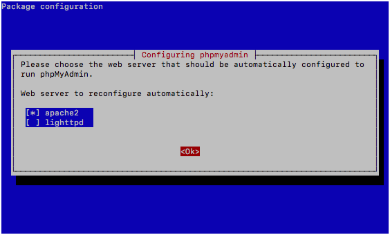
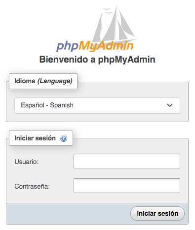
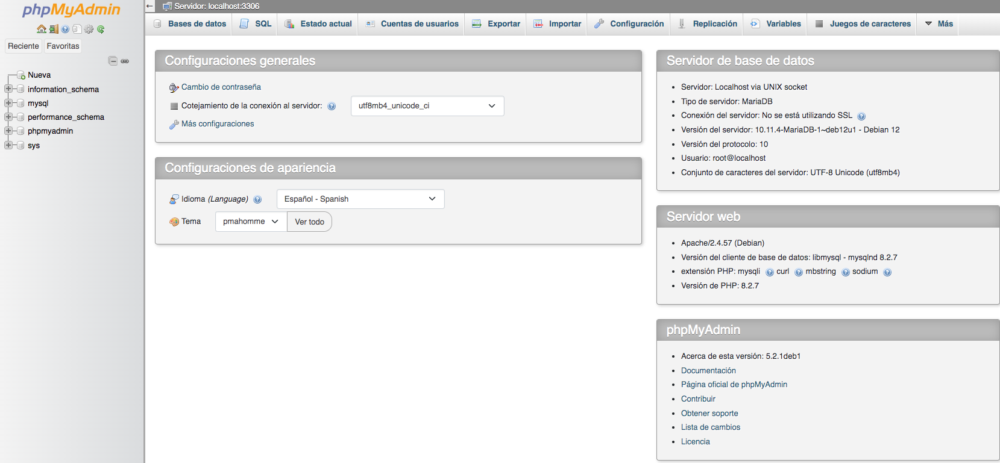

## ¿Qué vas a aprender en esta práctica?

* A instalar y usar varias herramientas relacionadas con la administración de la base de datos. 
* A instalar y usar herramientas de análisis de logs del servidor web.
  
## Herramientas de administración de bases de datos basadas en la web.

Las herramientas de administración de bases de datos basadas en la web han ganado una gran popularidad en los últimos años debido a su facilidad de uso y accesibilidad desde cualquier lugar con una conexión a Internet. Estas aplicaciones permiten a los administradores de bases de datos y desarrolladores gestionar, mantener y consultar bases de datos de manera eficiente, sin necesidad de instalar software adicional en sus dispositivos locales. Dos de las herramientas de administración de bases de datos más conocidas y ampliamente utilizadas son phpMyAdmin y Adminer.

### phpMyAdmin

phpMyAdmin es una de las herramientas de administración de bases de datos basadas en la web más antiguas y populares. Está escrita en PHP y ofrece una amplia gama de características.

Ventajas de phpMyAdmin:

- Amplias características: phpMyAdmin proporciona una amplia gama de funcionalidades avanzadas, como la gestión de usuarios, la importación/exportación de datos y la ejecución de consultas SQL complejas.

- Amplia comunidad: Debido a su larga historia, phpMyAdmin cuenta con una comunidad activa que proporciona soporte y numerosos complementos.

- Soporte multiplataforma: Puede funcionar en diversas plataformas y es compatible con varias bases de datos, incluyendo MySQL y MariaDB.

Inconvenientes de phpMyAdmin:

- Interfaz compleja: Su interfaz de usuario puede parecer abrumadora para los usuarios principiantes debido a la gran cantidad de características disponibles.

- Requisitos de recursos: PhpMyAdmin tiende a requerir más recursos en comparación con Adminer, lo que puede ser un problema en servidores con limitaciones de recursos.


### Adminer

Adminer es una herramienta de administración de bases de datos basada en la web que se destaca por su simplicidad y eficiencia.

Ventajas de Adminer:

- Interfaz de usuario intuitiva: Adminer ofrece una interfaz de usuario sencilla y fácil de entender, lo que la hace ideal para usuarios principiantes.

- Tamaño pequeño: Adminer es una aplicación ligera y de código abierto que no requiere una gran cantidad de recursos para funcionar.

- Soporte para múltiples bases de datos: Adminer no se limita a MySQL; también admite PostgreSQL, SQLite, MS SQL y otros sistemas de gestión de bases de datos.

- Actualizaciones regulares: Se actualiza regularmente para corregir errores y agregar nuevas características.

Inconvenientes de Adminer:

- Menos características avanzadas: Aunque es fácil de usar, Adminer puede carecer de algunas de las características avanzadas que ofrecen otras herramientas.

En resumen, la elección entre Adminer y phpMyAdmin dependerá de las necesidades y preferencias individuales. Adminer es ideal para aquellos que buscan simplicidad y facilidad de uso, mientras que phpMyAdmin es más adecuado para usuarios que requieren una amplia gama de características avanzadas y están dispuestos a invertir tiempo en aprender su interfaz más compleja.

## Instalación phpmyadmin


Para ello

```bash
sudo apt install phpmyadmin
```

La instalación es bastante automática, aunque nos hará algunas preguntas. 

* Primero nos preguntará por el servidor web que tenemos instalado. Lógicamente le diremos que `apache2`.

    

* Después nos preguntará si gestionamos la configuración de phpMyAdmin con "dbconfig-common". Le diremos que si.

Como hemos optado por "dbconfig-common", normalmente se crea automáticamente:

* Base de datos: phpmyadmin
* Usuario: phpmyadmin
* Contraseña: la que pusiste durante la instalación (si no pusiste ninguna, suele generar una aleatoria y la guarda en /etc/phpmyadmin/config-db.php)

Abre /etc/phpmyadmin/config-db.php para comprobar la contraseña exacta
  
Habilita phpmyadmin en Apache y reinicia apache:

```bash
sudo ln -s /usr/share/phpmyadmin /var/www/html/phpmyadmin
sudo systemctl restart apache2
```

Ahora ya puedes acceder a la página de phpMyAdmin con

`http://IPservidorDebian/phpmyadmin`

Te pedirá el usuario y contraseña. Recuerda que están en /etc/phpmyadmin/config-db.php.



Y si todo va bien estarás dentro para poder gestionar las bases de datos de tu MariaDB.




!!!Question "Tarea de ampliación 1"
    Descarga el fichero [`musica.sql`](https://gvaedu-my.sharepoint.com/:u:/g/personal/mv_nebotromero_edu_gva_es/EbWYNXryFetAg32Gl1qijfUBgQLyYqXHoaphd00rjt9YwA?e=qY2lF5) y después impórtalo a tu servidor MySQL a través de la interfaz de **phpMyAdmin**. Despliega y observa todas las tablas que tiene la base de datos.

!!!Question "Tarea de ampliación 2"
    En la interfaz de **phpMyAdmin**, realiza las consultas del Anexo I del siguiente [documento](https://gvaedu-my.sharepoint.com/:w:/g/personal/mv_nebotromero_edu_gva_es/EWPqtwnNL3BPu65FBNHw1TQBCMqvp8Zmc5ai1_nRDdlwaw?e=mDsTFU), en donde tienes una descripción de la base de datos `musica.sql` que acabas de importar en la tarea anterior.

## Instalación Adminer

La instalación de Adminer es muy sencilla. Te propongo que lo investigues y lo instales en la siguiente tarea.

!!!Question "Tarea de ampliación 3"
    Instala **Adminer** en tu servidor web y explora su interfaz, comparándola con la de phpMyAdmin. Para ello simplemente tendrás que poner el fichero PHP de adminer en el DocumentRoot de apache. Puedes copiar dicho fichero a tu servidor mediante scp. 


## Herramientas de análisis de logs

El análisis de logs en servidores web es una práctica esencial para comprender y optimizar el rendimiento, la seguridad y la usabilidad de un sitio web. Los logs son registros de eventos que el servidor web genera de forma automática, registrando información sobre las solicitudes de los usuarios, los errores, el tráfico y otros datos importantes.

Dos herramientas populares para el análisis de logs en servidores web son GoAccess y AWStats:

### GoAccess

Se trata de una herramienta de línea de comandos y una aplicación web que proporciona análisis en tiempo real de los logs del servidor web. Es altamente configurable y puede utilizarse para analizar logs de Apache, Nginx y otros servidores web. Entre las ventajas de la herramienta destacan las siguientes:

  - Interfaz en tiempo real que muestra estadísticas actualizadas en tiempo real.
  - Soporte para múltiples formatos de logs.
  - Fácil de instalar y usar.
  - Genera informes interactivos y visuales.
  
Respecto a sus incovenientes destacan los siguientes:

  - No es tan completo en términos de características detalladas como AWStats.
  - La interfaz de línea de comandos puede no ser adecuada para todos los usuarios.

Para usar GoAccess, puedes ejecutarlo en la línea de comandos y apuntarlo a tus archivos de logs. Por ejemplo: `goaccess -f /var/log/apache2/access.log`.

### AWStats

Se trata de una herramienta de análisis de logs más antigua y ampliamente utilizada. Proporciona informes detallados y estáticos sobre el tráfico del servidor web, la información demográfica de los visitantes y más. Entre sus ventajas destacan las siguientes:

  - Ofrece informes detallados y personalizables.
  - Funciona con una variedad de servidores web y formatos de logs.
  - Muestra gráficos y tablas detalladas.

Entre los inconvenientes de la herramientas destacan los siguientes:

  - No proporciona análisis en tiempo real.
  - La configuración inicial puede ser más complicada que GoAccess.
  - Los informes son estáticos y no se actualizan en tiempo real.

Después de configurar AWStats para analizar tus logs, puedes acceder a los informes a través de un navegador web. Los informes suelen estar disponibles en una URL específica, como `http://tusitio.com/awstats/awstats.pl`.

En resumen, GoAccess es una opción ideal para obtener análisis en tiempo real de logs de servidores web con una interfaz interactiva, mientras que AWStats es más adecuado para informes detallados y estáticos sobre el tráfico web. La elección entre estas herramientas dependerá de las necesidades específicas y preferencias.

!!!Question "Tarea 2"
    Averigua cómo instalar GoAccess en tu servidor, instálalo y genera los logs del servidor web apache en tiempo real y guárdalos en un archivo llamado `report.html` accesible desde la raíz de apache. Visualiza ese fichero de logs desde el navegador.
