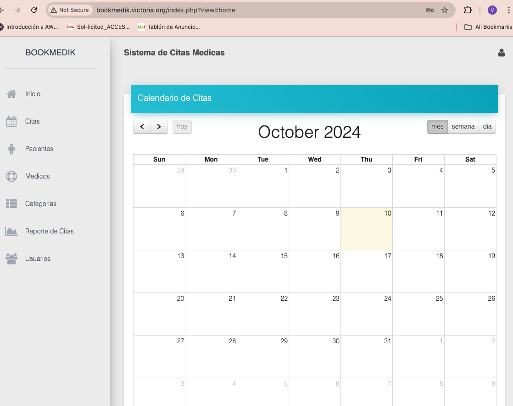

## ¿Qué vas a aprender en esta práctica?

* A desplegar una aplicación PHP construida a medida en nuestro servidor LAMP.

## Introducción

Como ya sabemos tenemos 3 maneras principales para ejecutar código PHP:

* Desde la línea de comandos (**cli**).
* Con el servidor web **Apache2** y el módulo **libapache2-mod-php**. 
* Con un servidor web y el servidor de aplicaciones **fpm-php**. 

Nosotros utilizaremos la segunda opción.

La configuración de php está dividida según desde donde se use:

* `/etc/php/8.2/cli`: Configuración de php para `php8.2-cli`, cuando se utiliza php desde la línea de comandos.
* `/etc/php/8.2/apache2`: Configuración de php para apache2 cuando utiliza el módulo.
* `/etc/php/8.2/fpm`: Configuración de php para php-fpm.
* `/etc/php/8.2/mods-available`: Módulos disponibles de php que puedes estar configurados en cualquiera de los escenarios anteriores.

Si nos fijamos en la configuración de php para apache2 con el módulo:

* `/etc/php/8.2/apache2/conf.d`: Módulos instalados en esta configuración de php.
* `/etc/php/8.2/apache2/php.ini`: Configuración de php para este escenario.

## Tarea

!!!Question "Tarea 1"
    La tarea consiste en instalar la aplicación BookMedik, una aplicación web a medida para llevar el control de citas médicas, pacientes, médicos, historiales de citas, áreas médicas y mucho mas, pensado para centros médicos, clínicas y médicos independientes. Puedes encontrar la aplicación en este [enlace](https://github.com/victoria-nr/bookmedik).

Para realizar la instalación sigue los siguientes pasos:

1. Crea un virtualhost con el que accederás con el nombre `bookmedik.tunombre.org`.  Copia en el *DocumentRoot* (`/var/www`) el directorio con los ficheros de la aplicación. Para ello, puedes clonar con git el repositorio en `/var/www`. Si has configurado bien el virtual host y has modificado el fichero `/etc/hosts` del cliente, deberías poder acceder desde el navegador a la interfaz web inicial de la aplicación web mediante: `http://bookmedik.tunombre.org`
   
2. Crea la base de datos y las tablas necesarias recuperando la copia de seguridad de la base de datos que encuentras en el fichero `schema.sql`. Este fichero se encuentra dentro del directorio `bookmedik`. Para ello, puedes restaurar la copia de seguridad desde el terminal ejecutando `sudo mariadb < schema.sql` o bien importando el fichero `schema.sql` desde phpmyadmin. En cualquier caso, comprueba que se ha creado la base de datos  `bookmedik` con sus correspondientes tablas. 
   
3.  Crea un usuario que tenga privilegios sobre dicha base de datos. Para ello, puedes hacerlo desde el terminal accediendo a mariadb con  `sudo mariadb` tal y como hicimos en la primera práctica o desde la interfaz de phpmyadmin.

4. Vamos a configurar el acceso a la base de datos desde la aplicación, para ello cambia el fichero `core\controller\Database.php` indicando el usuario de acceso (el que has creado en el punto 3), su contraseña, la base de datos que se llama `bookmedik` y la dirección donde se encuentra la base de datos, que en este caso es `localhost`. Esto lo tienes que cambiar en la línea donde se establece la conexión a la base de datos `$con = new myssqli(...)`.[^1]
   
5. Accede a la aplicación web desde el navegador usando la URL configurada en el virtualhost. Debería aparecer la siguiente imagen:
    

6. Accede a la aplicación con el usuario `admin` y contraseña `admin`. Deberías poder ver la aplicación con sus menus.
    

7. Para esta aplicación no es necesario, pero en determinadas aplicaciones es posible que necesitemos cambiar la memoria RAM que puede utilizar. Cambia la memoria máxima de uso de un script PHP (parámetro `memory_limit`) a 256Mb. ¿En qué fichero lo tienes que cambiar?.

[^1]: Esta práctica de "hardcodear" en el código PHP los datos de conexión a la base de datos (`host`, `usuario`, `contraseña`, `nombre de BD`) no es la más limpia ni elegante. Si quieres implementar una posible solución a este problema, te recomiendo que sigas la siguiente [extensión de la práctica](P3_4_AppBookMedik_extension_config_ini.md). 

<!--
## Evaluación

| Criterio      | Puntuación                         |
| :--------- | :----------------------------------: |
|  Configuración del virtualhost   |**2 puntos**  |
|  Contenido del fichero  `Database.php` | **2 puntos** |
|  Captura con el acceso a `bookmedik`, después del login| **3 puntos**|
|  Indica el fichero que has modificado (con el path completo) para modificar el límite de memoria. Muestra un pantallazo de la salida del fichero `info.php` donde se vea el cambio | **1 punto**|
| Se ha prestado especial atención al formato del documento, haciendo un correcto uso del lenguaje técnico y documentando de forma correcta todos los pasos del proceso|**2 puntos** |

-->

